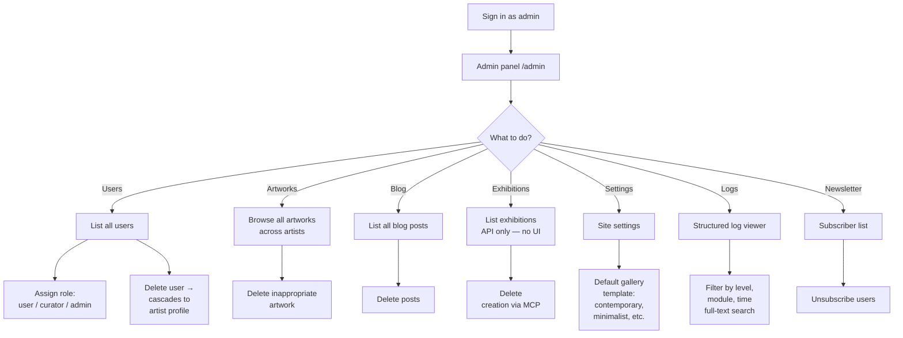

# Admin Workflow

**Status:** Active
**Last Updated:** 2026-05-19
**Owner:** Architecture

An admin is an authenticated user with `role=admin`. Admins have platform-wide control: manage users and roles, moderate content, configure site-wide settings, and inspect logs. There is no self-service signup for admins — roles are assigned by another admin.

## Journey

## Key entry points

- Admin page: `client/src/pages/admin.tsx`
- Routes: `server/routes.ts` — `/api/admin/*` guarded by `isAdmin` middleware
- User role updates: cascade nothing beyond the role column; user-deletion cascades to the artist profile
- Logs: streaming view backed by the structured logger (`server/index.ts` integration)
- MCP exhibition creation: `server/mcp.ts` exposes exhibition tools (admin path)

## Authorization

- Only `isAdmin` is permitted on `/api/admin/*` and the `/admin` UI route.
- Admins are **not** automatically artists. To upload artwork as an admin, a separate artist profile would be required — but the platform treats admin actions as moderation, not authoring.
- There is no audit log of admin actions today; structured logs capture the requests but not a curated history. Consider an ADR if this becomes a compliance requirement.
