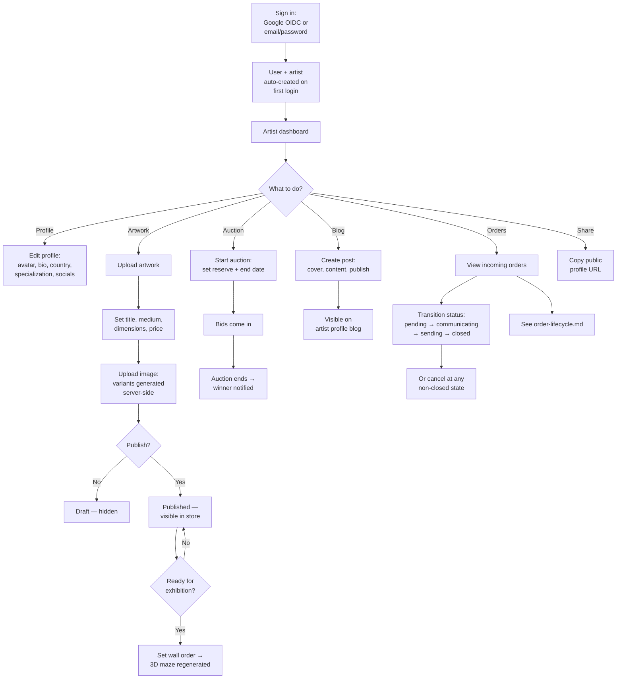

# Artist Workflow

**Status:** Active
**Last Updated:** 2026-05-19
**Owner:** Architecture

An artist is an authenticated user with `role=user` and an associated record in the `artists` table. Artist profiles are auto-created on first login. Artists upload, exhibit, and sell their own artworks, and fulfill incoming orders.

## Journey

## Key entry points

- Dashboard: `client/src/pages/artist-dashboard.tsx`
- Auth: `server/replit_integrations/auth/` (Passport + OIDC + local)
- Routes: `server/routes.ts` — artwork CRUD, auction creation, order status transitions
- Storage layer: `server/storage.ts` (`DatabaseStorage`)
- Image variants: `server/lib/artwork-image.ts`, `script/backfill-artwork-variants.ts`
- Gallery layout regeneration: triggered when `isReadyForExhibition` toggles on any artwork

## Ownership rules

- Artists may only modify their **own** artworks, auctions, blog posts, and orders. Ownership is checked in route handlers (`server/routes.ts`).
- Curators (`role=curator`) **cannot** have an artist profile — creating one returns 403 (`server/routes.ts:406`).
- Artists cannot self-promote to curator or admin — only an admin can change roles.

## Order fulfillment

See [`order-lifecycle.md`](./order-lifecycle.md) for the full state machine. The artist owns the transition from `pending` onward; visitors only create orders in the `pending` state.
