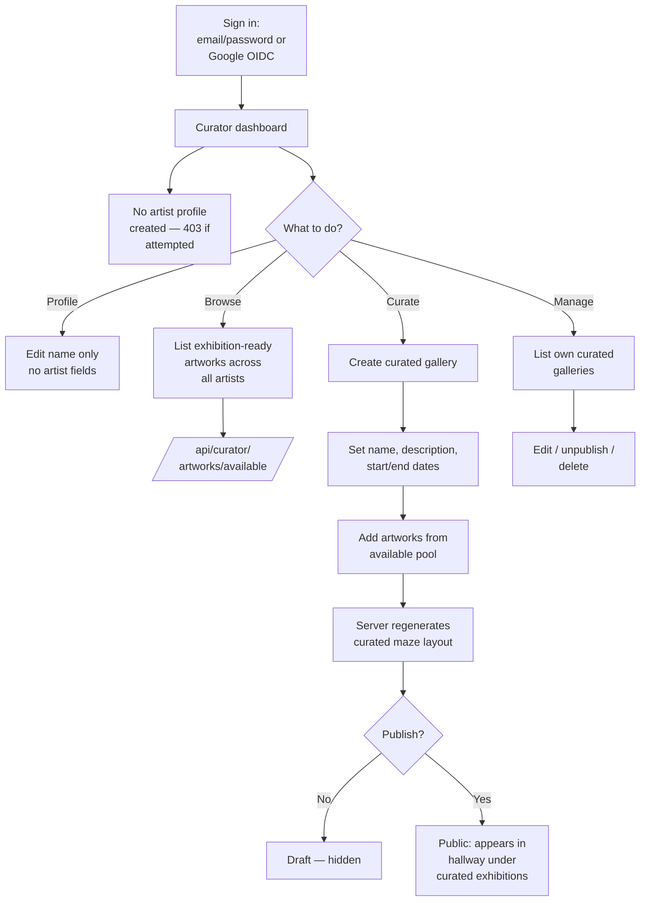

# Curator Workflow

**Status:** Active
**Last Updated:** 2026-05-19
**Owner:** Architecture

A curator is an authenticated user with `role=curator`. Curators assemble **curated galleries** from existing exhibition-ready artworks across all artists. They do not own artworks and cannot have an artist profile.

Curators are appointed by an admin. See [ADR-0008](../ADR/) for the RBAC design.

## Journey

## Key entry points

- Routes: `server/routes.ts` — `/api/curator/*` guarded by `isCurator` middleware
- Available artworks endpoint: `/api/curator/artworks/available` — returns all published artworks marked `isReadyForExhibition=true`
- Curated gallery storage: persists as records with cross-artist artwork references; layout JSON cached server-side
- Public surface: curated galleries surface in `client/src/components/hallway-gallery-3d.tsx` alongside artist rooms

## Ownership rules

- Curators may only modify **their own** curated galleries.
- Curators cannot edit artworks (only artists and admins can).
- Curators cannot have an artist profile — `POST /api/artists/me` returns 403 for `role=curator` (`server/routes.ts:406`).

## Relationship to artist exhibitions

| Concept | Owner | Scope |
|---------|-------|-------|
| Artist exhibition | Artist | Single artist's own artworks in their maze room |
| Curated gallery | Curator | Selected artworks across many artists in a shared themed maze |

Both are rendered by `components/maze-gallery-3d.tsx` and listed in the main hallway, but the data sources and permission checks are distinct.
