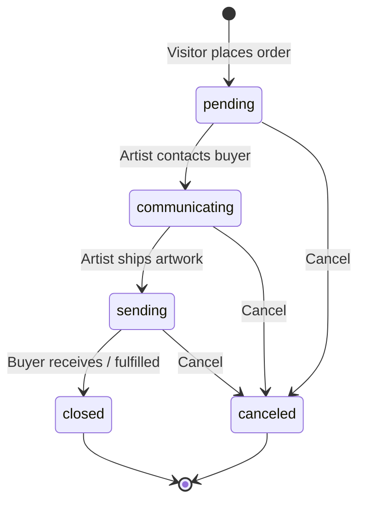

# Order Lifecycle

**Status:** Active
**Last Updated:** 2026-05-19
**Owner:** Architecture

The order status state machine, shared by the visitor checkout path and the artist fulfillment path. Defined in `CLAUDE.md` and enforced by `server/routes.ts`.

## State machine

## States

| State | Meaning | Who triggers entry |
|-------|---------|--------------------|
| `pending` | Order created, awaiting artist outreach | Visitor (checkout) |
| `communicating` | Artist has begun coordinating delivery with buyer | Artist |
| `sending` | Artwork has shipped | Artist |
| `closed` | Fulfilled and finalized | Artist |
| `canceled` | Aborted at any non-closed state | Artist (or buyer on request) |

## Rules

- `closed` is terminal — no further transitions.
- `canceled` is reachable from `pending`, `communicating`, or `sending`. Once an order is `closed`, it cannot be canceled.
- Transitions are linear (no skipping forward): `pending → communicating → sending → closed`. Each step requires the prior step.
- Status changes are restricted to the **owning artist** and **admins** by route guards in `server/routes.ts`.
- Buyers (visitors) do not have a UI to transition status — cancellation is handled artist-side after buyer contact.

## Related workflows

- [`visitor.md`](./visitor.md) — how an order enters `pending`.
- [`artist.md`](./artist.md) — how an artist moves an order through the remaining states.
