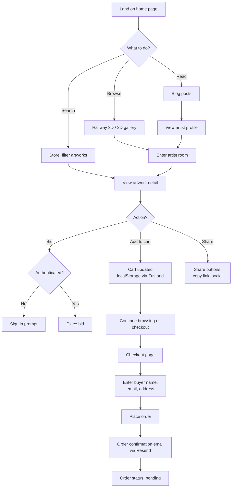

# Visitor Workflow

**Status:** Active
**Last Updated:** 2026-05-19
**Owner:** Architecture

The visitor is an unauthenticated public user. They can browse all published content, build a cart, and check out as a guest. No account required.

## Journey

## Key entry points

- Home: `client/src/pages/home.tsx`
- Gallery hallway: `client/src/pages/gallery.tsx` → `components/hallway-gallery-3d.tsx`
- Store: `client/src/pages/store.tsx`
- Artwork detail: `client/src/pages/artwork-detail.tsx`
- Artist profile: `client/src/pages/artist-profile.tsx` → `components/maze-gallery-3d.tsx`
- Blog: `client/src/pages/blog.tsx`, `client/src/pages/blog-post.tsx`
- Checkout: `client/src/pages/checkout.tsx`

## Notes

- Cart is persisted to `localStorage` (`client/src/lib/cart-store.ts`) — survives navigation and page reloads.
- Guest checkout is supported: order creation accepts buyer details without an authenticated session.
- Bidding requires authentication (`isAuthenticated` middleware on `POST /api/auctions/:id/bids`).
- Sharing artworks generates Open Graph cards server-side; analytics are logged via `share_events` (#503).
